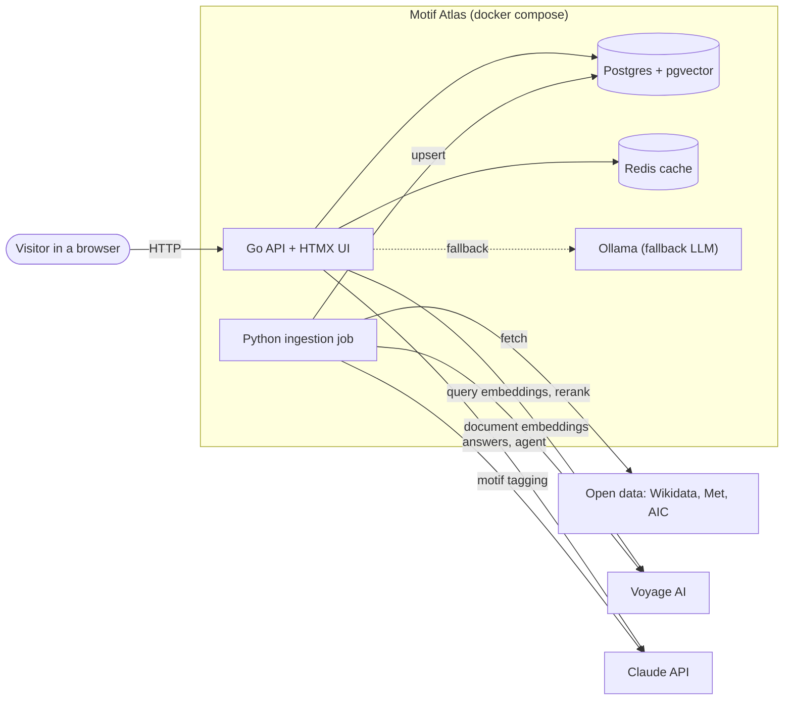

# motif-atlas
Explore art and architecture by tradition and motif

## Architecture

```mermaid
flowchart LR
    user([Visitor in a browser])

    subgraph atlas["Motif Atlas (docker compose)"]
        api[Go API + HTMX UI]
        ingest[Python ingestion job]
        pg[(Postgres + pgvector)]
        redis[(Redis cache)]
        ollama["Ollama (fallback LLM)"]
    end

    sources[Open data: Wikidata, Met, AIC]
    voyage[Voyage AI]
    claude[Claude API]

    user -->|HTTP| api
    api --> pg
    api --> redis
    api -->|query embeddings, rerank| voyage
    api -->|answers, agent| claude
    api -.->|fallback| ollama
    ingest -->|fetch| sources
    ingest -->|document embeddings| voyage
    ingest -->|motif tagging| claude
    ingest -->|upsert| pg
```